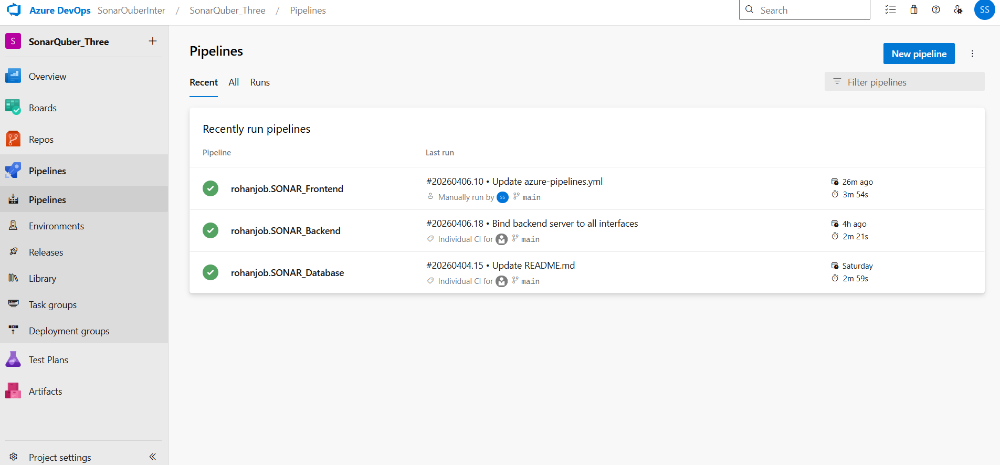
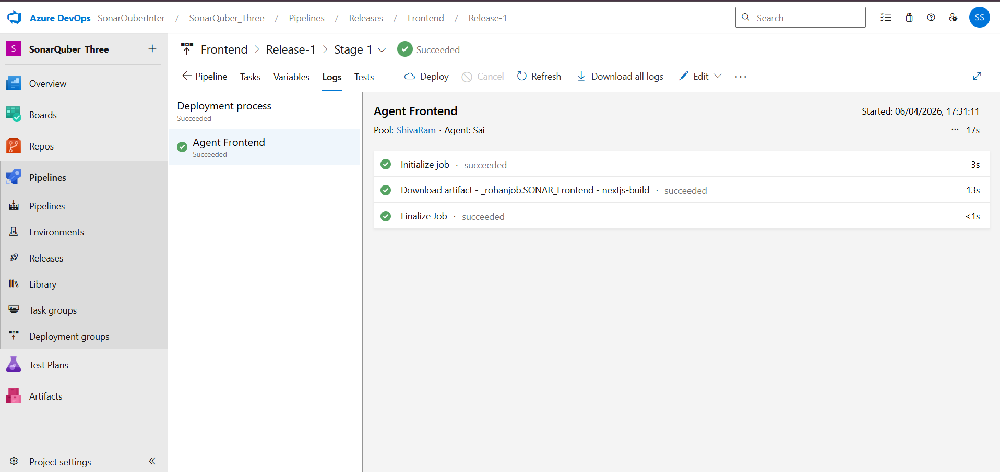
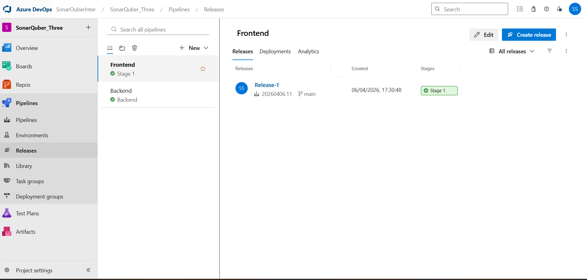
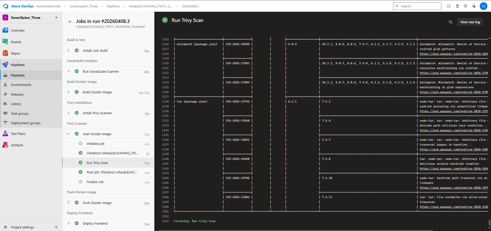
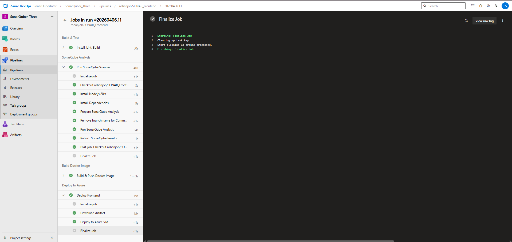

# 🚀 SSP Books - Frontend UI

Next.js frontend application for the SSP Books course buying platform.

## 🚀 Azure DevOps Deployment and Release





## 🛡️ SonarQube & Trivy CI/CD Pipeline



This project implements a secure "**Shift-Left**" Azure DevOps CI/CD pipeline:
1. **Build**: Tests and creates the Next.js production build.
2. **SonarQube Analysis**: Runs static application security testing (SAST) and code quality checks.
3. **Docker Build**: Containerizes the application.
4. **Trivy Scanning**: Analyzes the raw Docker image. Blocks staging if `HIGH` or `CRITICAL` vulnerabilities are discovered.
5. **ACR Push**: Dispatches the verified image to Azure Container Registry (`sspbooksacr.azurecr.io/ssp-books-frontend`).
6. **Azure Deployment**: Deploys the container to the live cloud environment.

## Getting Started

```bash
npm install
npm run dev
```

Open [http://localhost:3000](http://localhost:3000) with your browser to see the result.
